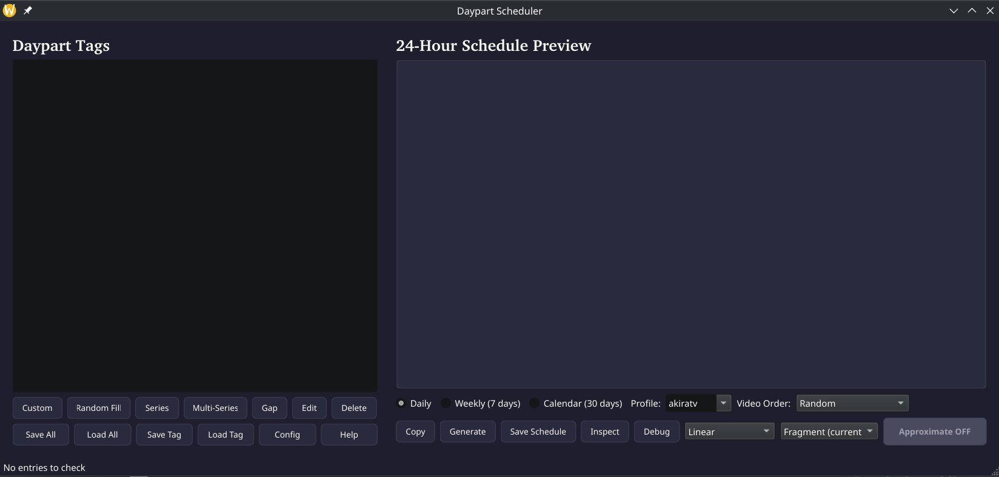

# Daypart Scheduler

Part of the AkiraTV IPTV Home Streamer. A TV scheduling tool for managing daypart-based program grids with custom tags, series scheduling, and gap filling.



## Requirements

- Python 3.10+
- PySide6

## Usage

```bash
python scheduler.py
```
